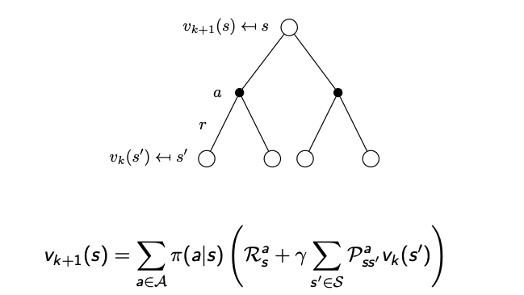

# Policy Iteration

Used for Planning Problems where the dynamics of a system are known. Specifically, requires knowledge of a probability transition matrix which expresses the probability of
transitioning into a set of future states after taking an action in a current state. Uses the Bellman Expectation Equation to evaluate a policy (updating the value of each state) and then improves that policy by acting greedily with respect to that policy. Repeats this process for a max number of iterations or until the policy stops changing between iterations (optimal policy found). Guaranteed to converge to optimal policy.

