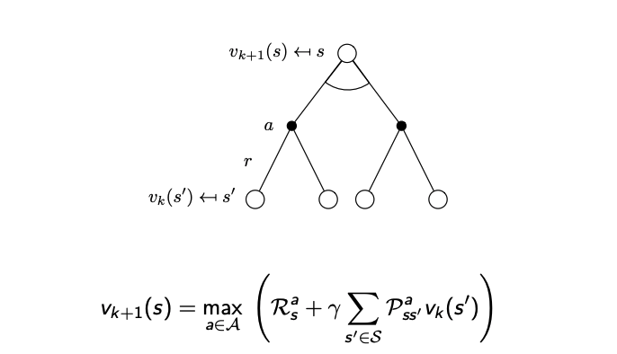

# Value Iteration

Used for Planning Problems where the dynamics of a system are known. Specifically, requires knowledge of a probability transition matrix which expresses the probability of
transitioning into a set of future states after taking an action in a current state. Uses the Bellman Optimality Equation to evaluate a policy (updating the value of each state) and then improves that policy by acting greedily with respect to that policy. 

Unlike Policy Iteration, it stays in value space instead of switching between policy evaluation and policy improvement. The only time a policy is 'evaluated', is at the last iteration where the final value function is converted to a policy by a greedy approach. At each iteration the state value function is updated with the maximum value of each state it can reach as opposed to an expectation over all the states it can reach as done in policy iteration.

Guaranteed to converge to optimal policy.

